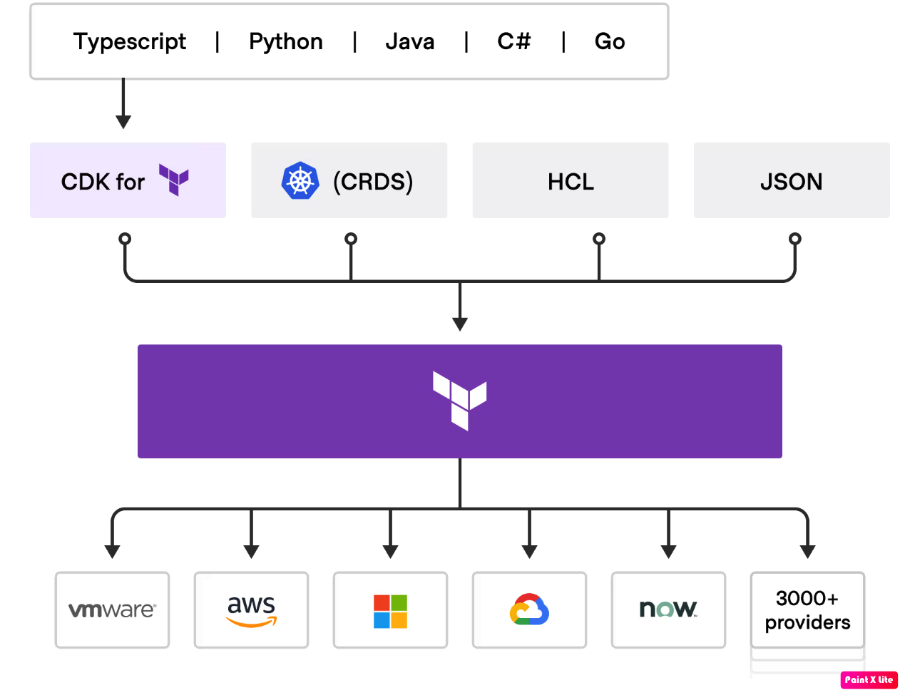

# CDK for Terraform Showcase

🌟 **Unlock the Power of CDK for Terraform!** ☁️✨

This project demonstrates the incredible potential of CDKTF with TypeScript. Learn how to effortlessly deploy AWS resources and build scalable applications.

## Features

- Easy deployment of AWS resources
- Scalable application architecture
- Built with TypeScript for enhanced development experience

## Architecture



## Getting Started

1. Clone the repository:
   ```bash
   git clone https://github.com/MikeO-AI/CDKTF-with-Typescript-Demo.git
   cd CDKTF-with-Typescript-Demo

2. Prerequisites
   ```
   # download and install Node.js for MacOS
   brew install node@20
   ```

   ```
   # download and install Node.js for Linux
   curl -fsSL https://deb.nodesource.com/setup_20.x | sudo -E bash
   sudo apt install -y nodejs
   ```

   If you need to have node@20 first in your PATH, run the below command but make sure to replace <your-user-id> with your actual user ID:

   ```
   echo 'export PATH="/opt/homebrew/opt/node@20/bin:$PATH"' >> /Users/<your-user-id>/.zshrc

   For compilers to find node@20 you may need to set:
   export LDFLAGS="-L/opt/homebrew/opt/node@20/lib"
   export CPPFLAGS="-I/opt/homebrew/opt/node@20/include"
   ```

   ```
   # verifies the right Node.js version is in the environment
   node -v # should print something similar to 'v23.9.0'
   ```

   ```
   # verifies the right npm version is in the environment
   npm -v # should print something similar to '11.2.0'
   ```

3. Initializing a new project with YARN:
   ```
   # This activates package managers like YARN and pnpm
   corepack enable

   # This will create a new project with YARN setup
   yarn init -y

   # This tells YARN how to manage dependencies with 3rd party packages
   yarn config set nodeLinker node-modules 

   # This tells YARN to use the node-modules directory for linking packages
   yarn install

   # Should match the version in package.json
   yarn -v

   # Add Typescript as a dev package dependency to just build the code, it's not a production dependency w/ -D flag
   yarn add -D typescript

   # Confirm its indeed installed
   yarn info typescript version 
   ```
4. Install Terraform CLI
   ```
   brew tap hashicorp/tap
   brew install hashicorp/tap/terraform
   brew update
   ```
5. Install CDKTF CLI
   ```
   npm install -g cdktf-cli
   ```
6. Verify CDKTF version
   ```
   cdktf --version
   ```
7. From an empty directory like `cdktf-fundamentals` or a new one create a new CDKTF project using local provider or remote provider of your choice. Here we will use the local provider.
   ```
   cdktf init --template=typescript
   ```