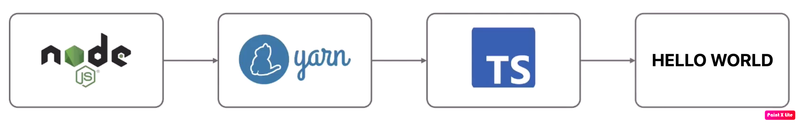

## Lab Setup



Ensure you have Node.js and npm installed, along with TypeScript before you begin.

1. Compile the TypeScript code:

    Open the terminal in VS Code.
    Compile the TypeScript file to JavaScript by running the following command:

    ```
     tsc index.ts
    ```
2. Run the JavaScript file using Node.js by running the following command:
    ```
    node index.js
    ```

3. Executing "Hello World"
   ```
   yarn add -D ts-node
   ```

4. Review the scripts section in package.json

5. Make sure everything is linked properly with the YARN project name
   ```
   yarn install
   ```

6. We must tell Typescript how to compile our code using tsconfig.json file

7. Now you can run `yarn dev` to execute hello-world script

8. Automatic Rerun on changes
   ```
   yarn add -D ts-node-dev
   ```
9. Hello World is working using YARN with Typescript
   ```
   yarn dev
   ```